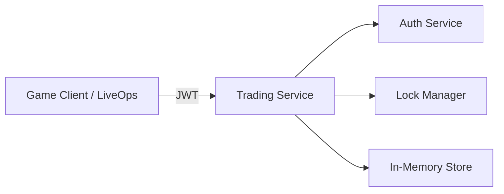

# 🎮 MMO Trading / Marketplace Service

A standalone **Trading & Marketplace backend service** designed for a **cross-platform social MMO** with player-driven economy and secure player-to-player trading.

This service simulates how modern MMO backends handle **atomic trades**, **asset locking**, and **secure completion** across distributed systems.

---

## ✨ Features

- 🔐 JWT-protected endpoints (shared auth model with game server)
- 🤝 Player-to-player trade offers
- 🔒 Atomic locking of items and currencies
- ✅ Trade completion with rollback safety
- 🧠 Clean service / store / routes architecture
- ⚡ Fastify + TypeScript (ESM)

---

## 🧱 Architecture Overview



**Key idea:**  
Assets are **locked at trade creation** and only released on completion or cancellation — preventing dupes and race conditions.

---

## 📦 Core Endpoints

### Create Trade
```
POST /trades
Authorization: Bearer <JWT>
```

Creates a trade offer and locks offered assets.

---

### Complete Trade
```
POST /trades/:id/complete
Authorization: Bearer <JWT>
```

Completes the trade atomically and releases all locks.

---

## 🛠 Tech Stack

- **Node.js 20**
- **Fastify**
- **TypeScript**
- **JWT (@fastify/jwt)**
- **ES Modules**
- **In-memory persistence (Map)**

> Designed to be easily replaceable with MongoDB / Redis.

---

## 🧠 Why This Matters for MMO Games

This project demonstrates:
- Safe player-to-player trading
- Atomic operations across services
- Lock-based economy protection
- MMO-style backend thinking

The same patterns apply to:
- UGC marketplaces
- Skin trading
- Player-driven economies
- LiveOps moderation tools

---

## 🚀 Getting Started

```bash
npm install
npm run dev
```

Server runs on:
```
http://localhost:3001
```

Health check:
```
GET /health
```

---

## 📄 License

MIT — free to use, modify, and extend.

---

## 👤 Author

Experienced Full-Stack Developer  
Focused on **MMO backends**, **game services**, and **player-driven economies**.